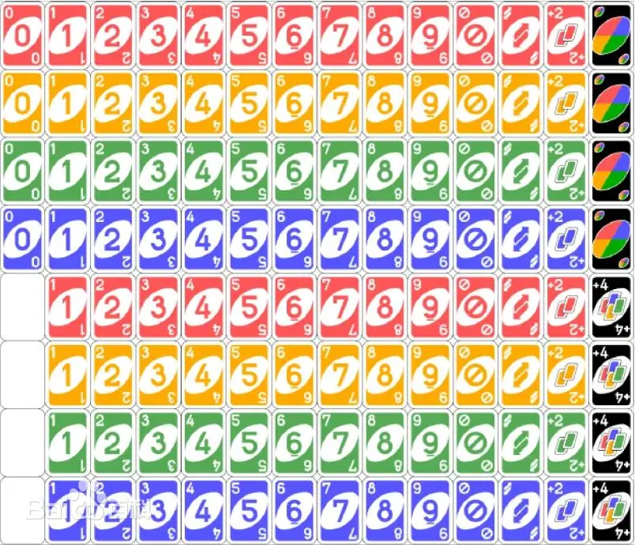

# UNO
## 概述
UNO是一个看谁把牌先出完并且让其他人疯狂抓牌的友尽游戏。

共分三类牌：数字牌（76张）、功能牌（24张）、万能牌（8张），合计108张。
牌面除了图案还有颜色区分，共红黄蓝绿黑5色。黑色为万能牌，其他牌除了数字0以外4色均分。

## 牌介绍

数字牌是最基础的牌，除了0外1-9数字4色各2张(9×4×2+1×4=76)

功能牌有3种，也是4色各2张(3×4×2=24)
1. 禁：跳过下家操作
2. 转：改变出牌顺序
3. +2：下家需要抽2张并跳过操作

万能牌有2种，每种各4张(2×4=8)
1. 变色：重设当前出牌颜色，并且取消图案设置
2. +4：下家需要抽4张并跳过操作，并重设出牌颜色与取消图案设置

## 出牌规则
除了万能牌外，其他牌均有颜色(4色之一)和图案(数字或功能)两种属性，每次出牌均会设置当前能出的颜色和图案，然后后续的出牌必须出和当前设置的颜色或图案一致的牌，第一位玩家必须出数字牌。下一个玩家则可以出同色的其他牌(数字、功能)或者其他色的同数字牌或者万能牌。

其中功能牌的+2和万能牌的+4为惩罚牌，一个玩家出+2后下一个玩家只能出+2或者+4，出+4后下一个玩家只能出+4，如没有对应的牌则需要进行摸牌，摸牌数为这一轮加的总和，摸完后无法出牌，再下一个玩家此时按出牌规则可以出同颜色的牌或者其他颜色的“+2”，如果最终为+4的话，以+4玩家设置的颜色为准。

其他功能牌(转、禁)，在功能完成后的后续出牌规则也同基础规则，可以出同色其他牌或其他色同功能的牌或万能牌，这两张功能牌的功能有最高优先级，打出后立马执行。(你问我为啥+2这个功能牌要搞特殊？因为uno官方设定的+2也是立马执行功能不能继续跟牌的，但是uno官方他懂什么uno，全国各地规则千千万就这一条惊人地一致) 

万能牌可以在任何数字牌或者功能牌(功能完成)以后打出，就是如果到你正常出牌了，那你的黑牌一定能出(转和禁直接就是不让你出牌，+2+4是属于赋予了独特出牌规则。)
特殊规则
1. 当自己手上只有一张牌时需要喊出uno，若没喊出被别人抓住需要抽一张牌，但是如果没被抓住且下一个玩家已经出过牌了则无需抓牌(即只能当场抓住，过了就逃掉了，都盯紧了)
2. 最后一张牌不是数字牌的话打出后需要再抽一张，并且不能继续打出(功能牌万能牌可以留一手但是别留到最后…)
3. 如果自己手上有和当时出牌一样的同色数字牌，可以喊出“抢”并打出那张一样的牌，然后下一个出牌玩家换成“抢”的下家。抢优先于正常出牌，即同时有人喊出了抢以及下一家打出牌，则下一家需要收回。
获胜规则
初始会每人发7张牌，然后按出牌规则逆时针顺次出牌，无法出牌的人则抓牌，抓到的牌如果可以出则可以打出(仅限抓到的那张，即不可抓一张然后打出别的牌)，先出完则获胜，获胜后本局结束。
